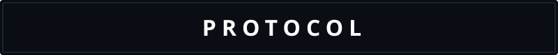

  

  
  
  
  

<h3 align="center">
  <code style="color: #00d2ff;">Stealth AI | RAG Pipelines | Backend Architecture</code>
</h3>

---

  

  <code style="color: #ff3366;">➤ Not a developer who codes. A builder who structures vectors and retrieves in silence.</code>

---

<h2 align="center">🗣️ WHO AM I 🗣️</h2>

<table width="100%" border="0" cellpadding="0" cellspacing="0">
  <tr>
    <td width="50%" valign="top">
<pre lang="yaml">
identity:
  name: Shivam Kumar
  alias: Shivam8292
  location: Chandigarh, India IN
  institution: Chandigarh University
  degree: B.E. (Hons) CSE AI &amp; ML (2026)
  cgpa: 7.88 / 10.0 [|||||||   ]

philosophy: "Transforming unstructured data 
             into actionable intelligence."

currently:
  building: Reposage (AI Code Search)
  exploring: Advanced RAG Optimization
  studying: Latency reduction in LLM pipelines

open_to:
  - AI Developer / Backend Internships
  - Open-source RAG contributions
</pre>
    </td>
    <td width="50%" valign="top">
<pre lang="python">
# shivam.py - runtime context

class Developer(Shivam):
    @property
    def philosophy(self) -> str:
        return (
            "Convert complex data into "
            "structured knowledge. "
            "Speed it up. Scale it."
        )

    def superpowers(self) -> list[str]:
        return [
            "Function-level AST chunking",
            "Asynchronous RAG pipelines",
            "FastAPI backend optimization",
            "Semantic code vector search",
            "ChromaDB indexing pipelines"
        ]
</pre>
    </td>
  </tr>
</table>

---

<h2 align="center">🛸 CURRENTLY EMPOWERING PRODUCTIVITY 🛸</h2>

<table width="100%" border="0" cellpadding="0" cellspacing="0">
  <tr>
    <td width="50%" valign="top" style="padding: 10px;">
      <h3>🔍 Reposage — AI Code Search</h3>
      

        
        
        
        
      

<pre>
┌────────────────────────────────────────┐
│ 🔍 AST-Based Function Chunking         │
│ 🧠 Semantic Similarity Search          │
│ 📁 Multi-Repo Code Indexing            │
│ ⚡ Low-Latency FastAPI REST API        │
│ 💻 Responsive React UI Frontend        │
└────────────────────────────────────────┘
</pre>
      
<i>"Query your codebase in natural language and find exact lines."</i>

    </td>
    <td width="50%" valign="top" style="padding: 10px;">
      <h3>📄 AI Resume Screener</h3>
      

        
        
        
        
      

<pre>
┌────────────────────────────────────────┐
│ 📄 Semantic RAG Matching               │
│ 🏃 Asyncio Latency Reduction           │
│ 🎯 High-Precision Ranking              │
│ 📝 Explainable Skill Scoring           │
│ ⚙️ Groq Llama 3.3 Inference            │
└────────────────────────────────────────┘
</pre>
      
<i>"Rank bulk resumes against JDs with clear gap analyses."</i>

    </td>
  </tr>
</table>

---

<h2 align="center">⚔️ TECH ARSENAL ⚔️</h2>

<b>⚡ Primary Weapons — Languages I think in:</b>

  

<b>🧠 AI &amp; Vector Databases:</b>

  
  
  

<b>💻 Web &amp; Frontend:</b>

  

<b>🛠️ Infrastructure &amp; Dev Tools:</b>

  

---

<h2 align="center">📦 PRODUCTION REGISTRY 📦</h2>

<table width="100%">
  <thead>
    <tr>
      <th align="left">🚀 Project</th>
      <th align="left">📝 What It Does</th>
      <th align="left">🛠️ Stack</th>
      <th align="left">🚦 Status</th>
    </tr>
  </thead>
  <tbody>
    <tr>
      <td><b>🔍 Reposage</b></td>
      <td>Semantic code search engine indexing files at function level (AST) for natural language queries.</td>
      <td>FastAPI, LangChain, ChromaDB, React</td>
      <td></td>
    </tr>
    <tr>
      <td><b>📄 Resume Screener</b></td>
      <td>Asynchronous RAG candidate-JD ranking pipeline with explainable scoring feedback.</td>
      <td>FastAPI, Llama 3.3, Groq, Asyncio</td>
      <td></td>
    </tr>
    <tr>
      <td><b>🏢 Corporate Autopsy</b></td>
      <td>Forensic startup failure analysis automated reporting platform.</td>
      <td>Python, Gemini 2.0, RAG</td>
      <td></td>
    </tr>
    <tr>
      <td><b>🏢 EOXS Intern</b></td>
      <td>AI-powered ERP automation workflows and FastAPI backend integrations.</td>
      <td>Python, FastAPI, RAG, SQL</td>
      <td></td>
    </tr>
  </tbody>
</table>

---

  <code style="color: #ff3366;">➤ I LEAVE CODEBASES BETTER THAN I FOUND THEM</code>

---

<h2 align="center">⚡ BY THE NUMBERS ⚡</h2>

  <table border="0">
    <tr>
      <td>
        
      </td>
      <td>
        
      </td>
    </tr>
    <tr>
      <td colspan="2" align="center">
        
      </td>
    </tr>
  </table>
  
   
  
  

---

<h2 align="center">📡 CONNECT</h2>

  
  

